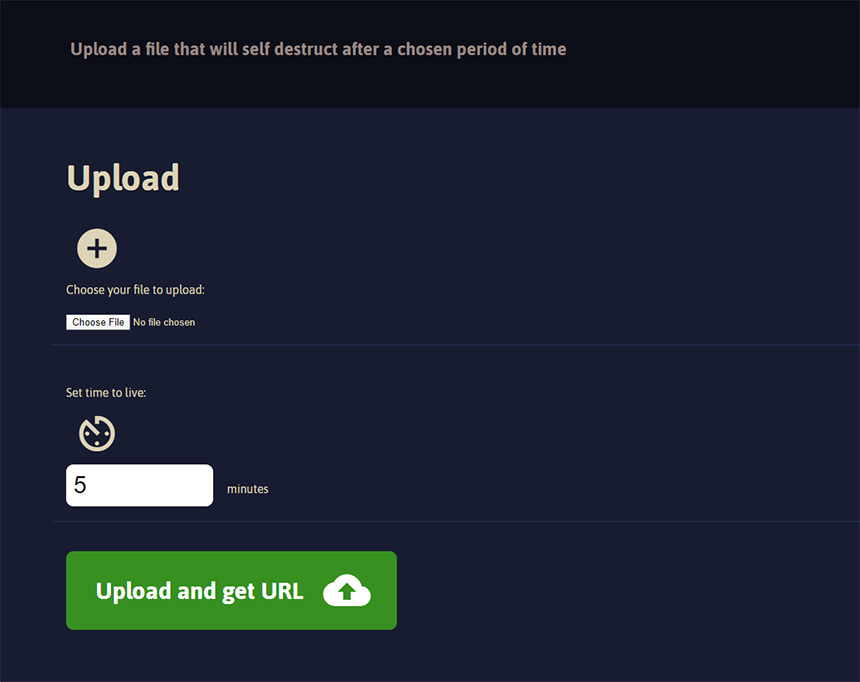

# Application for sharing assets with a self destruct functionality

[Watch a short video of how it works](https://www.youtube.com/watch?v=yYqq3jaEgU8&feature=youtu.be)

## What does it do?
It enables you to upload files to your server that will be deleted after a given time period.
The application generates a URL that you can copy and share.

The uploading interface is protected with basic auth. Set the credentials in your `env.json`.

## Install
* Clone the repo.
* `cd client`
* `npm i`
* `cd ../server`
* `npm i`
* Copy `env.example.json` to `env.json` and edit the configuration to fit your setup.

## Usage
* Navigate to your application
* Choose a file to upload
* Choose a TTL in minutes for the link to work
* Receive the URL and copy it for sharing
